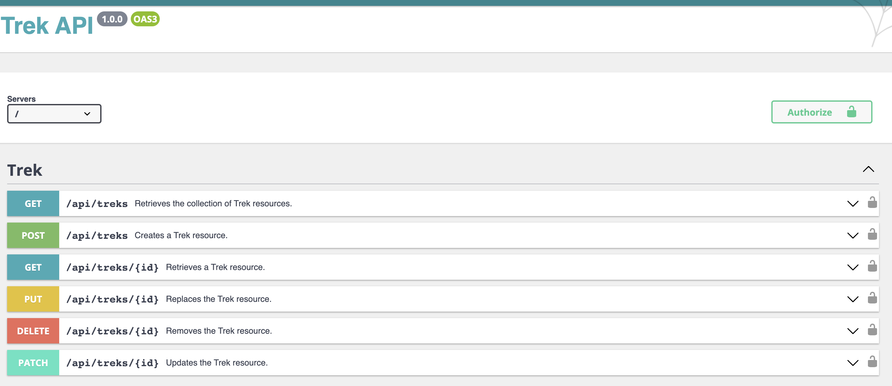
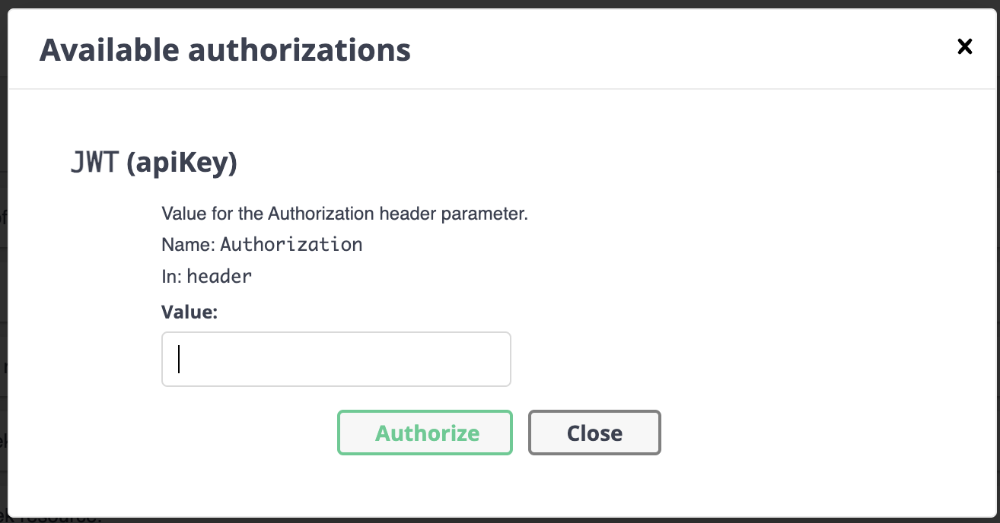
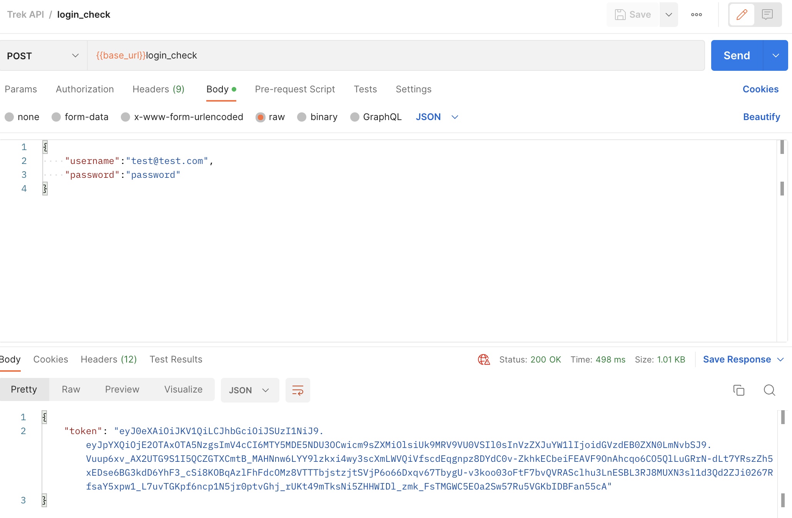

# Trek API

## Stack

- [Symfony](https://symfony.com/)
- [Api Platform](https://api-platform.com/)
- [Docker](https://www.docker.com/)
- [PostgreSQL](https://www.postgresql.org/)
- [Postman](https://www.postman.com/)

## Source code

```
git clone https://github.com/geoffreygirou/trek-api.git
```

## API Simple Tests
```
newman run ./postman/postman_collection.json -e ./postman/postman_environment.json
```

## Installation via Docker V3.x
Voir fichier ./Makefile
```
make up
```

## API Usage

Either you can use Postman or the Swagger UI.
Visit security.yml file for more details about authentication.

### Swagger UI

https://localhost/docs



Interacting with treks needs authentication



provide a valid token obtained from the login endpoint (create user if not already done)



## Symfony commands
```
make sf c='doctrine:database:create
```
```
make sf c='doctrine:migrations:migrate'
```
```
make sf c='doctrine:fixtures:load'
```
```
make sf c='doctrine:database:drop --force'
```